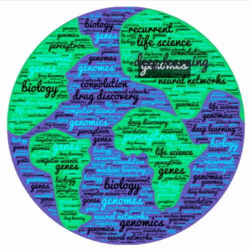

# Deep Learning for Life Sciences

> Example code from the book "Deep Learning for the Life Sciences"

> Working on colab-GPU

1. deepchem still works on Tensorflow 1.x [as of 24th July 2020, a nightly build for deep chem is available for tensorflow 2.x (deepchem v2.4 and above works with tensoflow 2)]
2. I am trying on colab since I don't have GPU.
3. I will try to fix any issues if the come and I also try to make a keras compatible code for easy understanding.

> before starting any notebook in colab

    ##setup tensorflow v1
    %tensorflow_version 1.x

> this will install anaconda and deepchem, will add path, execution will take sometime

    !wget -c https://repo.anaconda.com/archive/Anaconda3-2019.10-Linux-x86_64.sh
    !chmod +x Anaconda3-2019.10-Linux-x86_64.sh
    !bash ./Anaconda3-2019.10-Linux-x86_64.sh -b -f -p /usr/local
    !conda install -y -c deepchem -c rdkit -c conda-forge -c omnia deepchem-gpu=2.3.0
    import sys
    sys.path.append('/usr/local/lib/python3.7/site-packages/')
    
    
> import deepchem and check version

    import deepchem as dc
    dc.__version__ #should match with the installed
    
    
# Extra work done after following the tutorials

## Generative networks| Variational Autoencoders and GANs

> I attempted the tutotial in the book and generated the following molecules, it doesn't matter if they are biologically not feasible. I feel generative networks is a way of expressing art.

## Model Interpretation | JUND binding sites

> DL finds the motifs of JUND binding on DNA

# #####################################################################################
Chapters 1,2 and 12 do not have any exercises
# #####################################################################################
